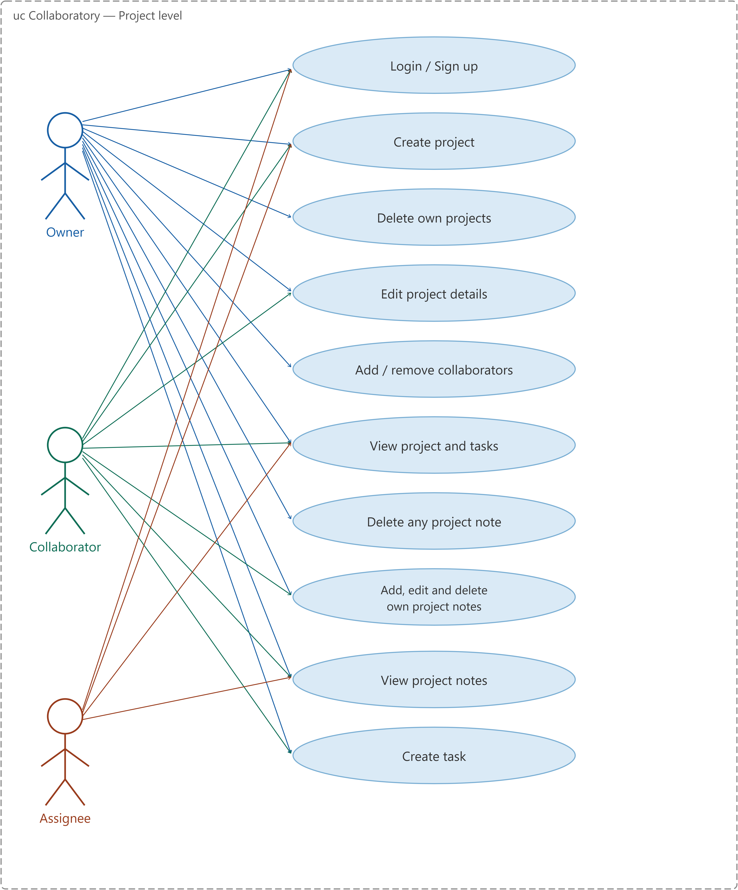
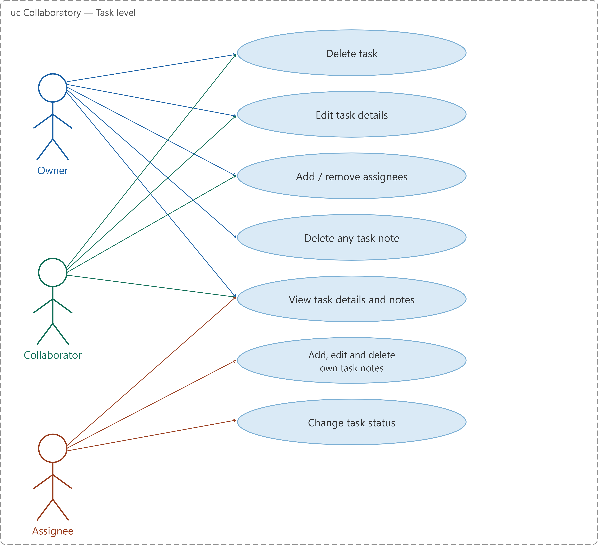
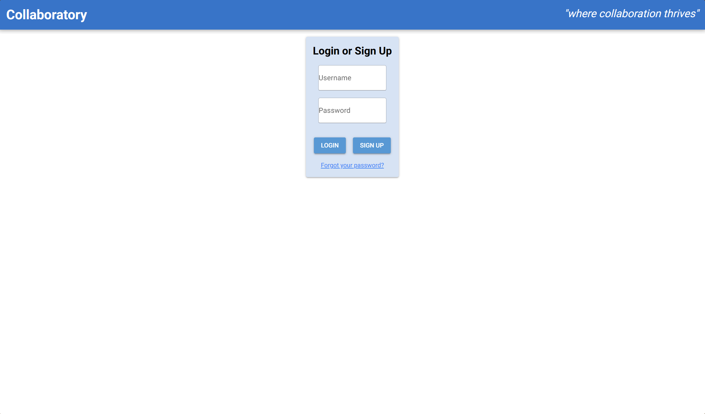
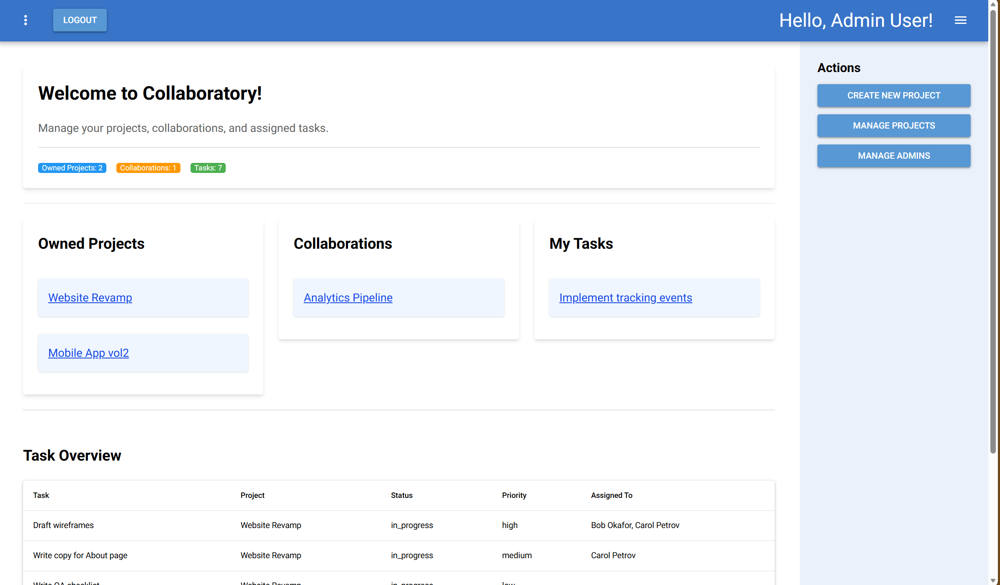
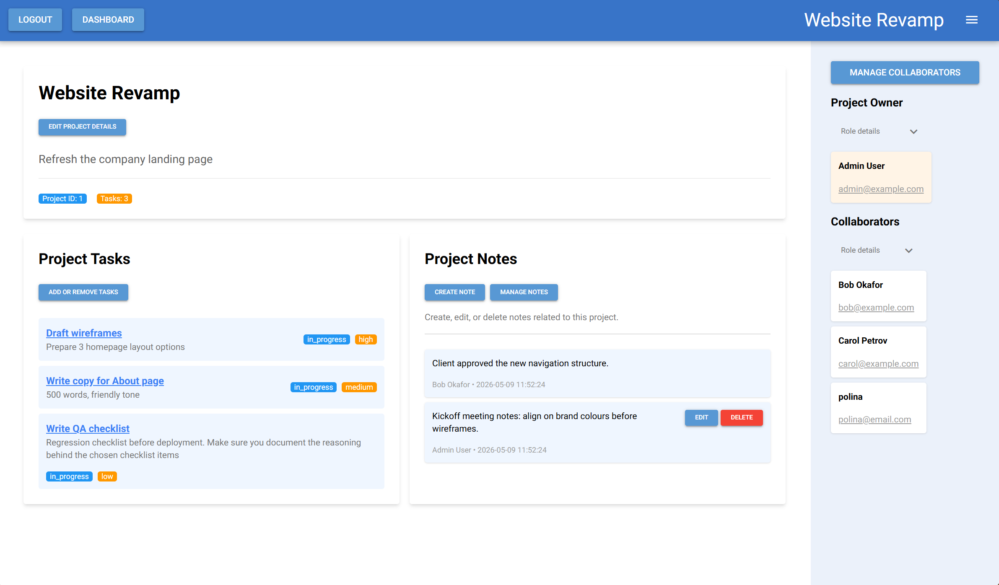
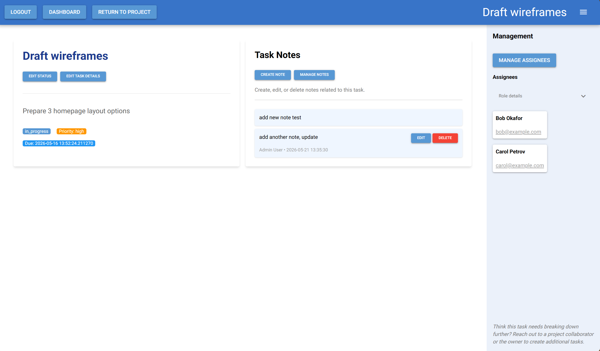
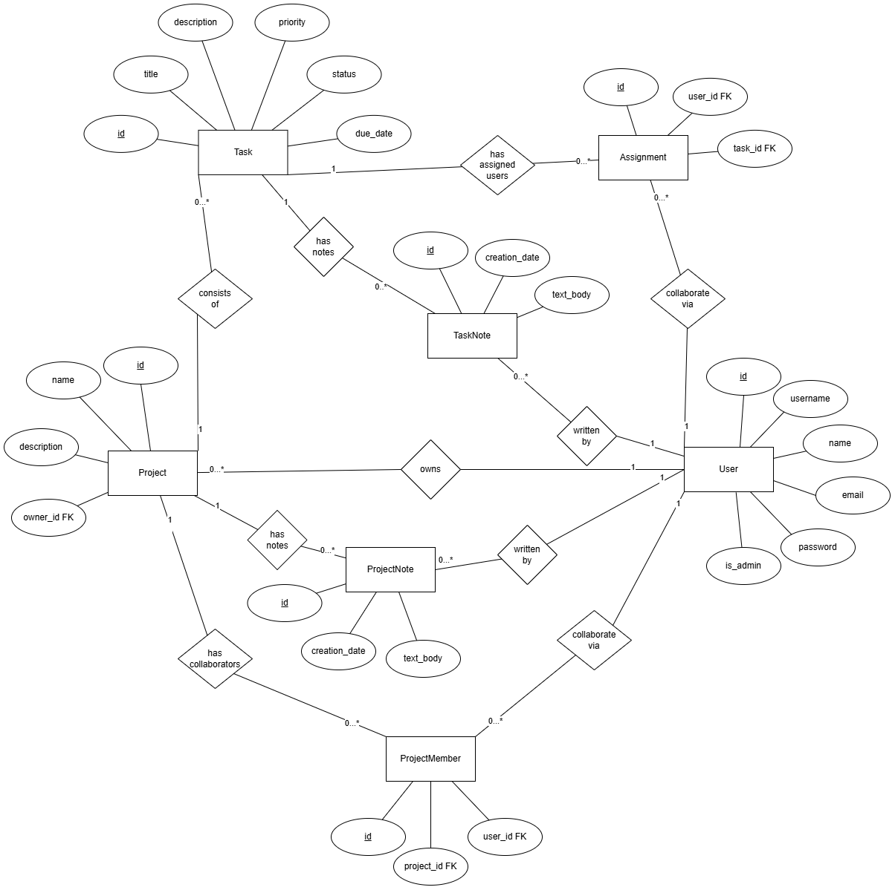

# Collaboratory

Collaboratory is a web-based team task management application built in Python. It supports three user roles: project owner, collaborator, and assignee: each with role-based permissions for creating, managing, and tracking tasks and notes across projects.

The application follows a 3-tier architecture using NiceGUI for the presentation layer, Python for the application logic, and SQLite with SQLAlchemy for data persistence.

It aims to:
- Implement a clean 3-tier layered architecture with clear separation of concerns between UI, logic, and data
- Validate all user input at the application boundary before processing or persisting
- Use SQLAlchemy as a full ORM for all database access: no raw SQL
- Cover core functionality with a meaningful automated test suite
- Demonstrate collaborative team development across a four-person team

## 📝 Analysis

### Problem

Development teams lack a lightweight, role-aware tool for managing tasks within a project. Without structured access control, any team member can modify or delete any task, making it difficult to maintain clear ownership and accountability across a shared project.

**Specific pain points:**
- **Uncontrolled access**: Team members can accidentally overwrite or delete critical work
- **No clear delegation**: Task assignments lack visibility and status tracking
- **Communication breakdown**: No integrated mechanism for task-related discussions
- **Admin bottleneck**: Owners must manually oversee every change

### Target Users

Collaboratory is designed for:
- **Small development teams** (3–20 people) needing lightweight task management
- **Project-based work** with clear ownership and role distinctions
- **Educational and professional settings** requiring role-based access control

### Scenario

A small team uses Collaboratory to manage a development project. The project owner creates the project and invites collaborators. Collaborators create tasks and assign them to team members. Assignees update task status (To Do → In Progress → Completed) and leave task notes to communicate progress. The owner monitors all tasks, manages collaborators, and can delete tasks when needed.

### Why Collaboratory?

Collaboratory solves these problems through:
- **Role-based access control**: Each team member has specific permissions tied to their role (Owner, Collaborator, Assignee, Admin)
- **Simple permission model**: 17 granular actions prevent unauthorized changes while enabling delegation
- **Lightweight and self-hosted**: No external service dependencies; runs in GitHub Codespaces or locally
- **Python-native**: Easy to understand, modify, and extend for educational purposes


## User Stories

### Owner

- As an Owner, I want to create a new project so that I can organise tasks for my team in one place.
- As an Owner, I want to manage collaborators so that I can control who has access to the project management.
- As an Owner, I want to create and assign tasks so that work is clearly distributed.
- As an Owner, I want to edit and delete tasks so that the project stays organised and up to date.
- As an Owner, I want to add and view project notes so that important information is documented and accessible.

### Assignee

- As an Assignee, I want to view projects and tasks so that I understand my responsibilities clearly.
- As an Assignee, I want to update the status of my tasks so that I can show my progress.
- As an Assignee, I want to add and view task notes so that I can share updates and understand task context.

### Collaborator

- As a Collaborator, I want to view projects and tasks so that I can support the Owner.
- As a Collaborator, I want to create and edit tasks so that I can help organise the project work.
- As a Collaborator, I want to assign tasks to users so that work is distributed effectively.
- As a Collaborator, I want to add and view project notes so that important information is shared within the team.

### Main Use Cases

#### Project Management
- **View Projects & Tasks**: Users can view projects and tasks they have access to.
- **Create & Manage Projects**: Owners create new projects and manage project details.
- **Edit Project Details**: Owners and Collaborators update project information and status.
- **Delete Projects**: Owners can remove entire projects.
- **Manage Collaborators**: Owners add or remove collaborators to control project access.

**Task Management**
- **Create & Edit Tasks**: Owners and Collaborators create and edit tasks within a project.
- **Assign Tasks**: Owners and Collaborators assign tasks to team members.
- **Change Task Status**: Assignees update task progress (To Do → In Progress → Completed).
- **Delete Tasks**: Owners and Collaborators remove tasks from the project.

**Collaboration & Documentation**
- **Project Notes**: Owners and Collaborators add, view, edit, and manage project-level notes.
- **Task Notes**: Assignees add and edit updates on tasks; Owners and Assignees can delete task notes.

**Admin & Recovery**

> **Note:** Admin status is strictly a recovery/override mechanism, not a normal operational role. Admins can only revoke their own admin status, not other admins' status. This prevents malicious actors from locking the recovery admin out of the system.

### Actors

- **Owner**: Creates and manages projects, tasks, collaborators, and project notes.
- **Collaborator**: Supports the Owner by managing tasks and project notes.
- **Assignee**: Works on assigned tasks and updates their status.

## 📖 Detailed Use Cases (Inputs / Outputs)

### Use Cases

#### Project level

**1. Login / Sign up**
As a user, I want to log in or create an account to access the application.

- **Actors:** Owner, Collaborator, Assignee
- **Inputs:** username (`str`), password (`str`)
- **Outputs:** authenticated session, redirect to dashboard

---

**2. Create project**
As a user, I want to create a new project that I will own.

- **Actors:** Owner, Collaborator, Assignee
- **Inputs:** project name (`str`), description (`str`)
- **Outputs:** created `Project` object, user set as owner

---

**3. Delete own projects**
As an owner, I want to delete a project I own.

- **Actors:** Owner
- **Inputs:** project id (`int`)
- **Outputs:** project and all associated tasks, notes, and memberships deleted

---

**4. Edit project details**
As an owner or collaborator, I want to update a project's name or description.

- **Actors:** Owner, Collaborator
- **Inputs:** project id (`int`), name (`str`), description (`str`)
- **Outputs:** updated `Project` object

---

**5. Add / remove collaborators**
As an owner, I want to add or remove collaborators from my project.

- **Actors:** Owner
- **Inputs:** project id (`int`), user id (`int`), action (`add | remove`)
- **Outputs:** updated `ProjectMember` list

---

**6. View project and tasks**
As any project member, I want to see a project and all its tasks.

- **Actors:** Owner, Collaborator, Assignee
- **Inputs:** project id (`int`)
- **Outputs:** `Project` object, list of `Task` objects

---

**7. Delete any project note**
As an owner, I want to remove any project note regardless of who wrote it.

- **Actors:** Owner
- **Inputs:** project id (`int`), note id (`int`)
- **Outputs:** note deleted, updated notes list

---

**8. Add, edit and delete own project notes**
As an owner or collaborator, I want to write, update, and remove my own project notes.

- **Actors:** Owner, Collaborator
- **Inputs:** project id (`int`), content (`str`), note id (`int`) for edit/delete
- **Outputs:** created/updated/deleted `ProjectNote`

---

**9. View project notes**
As any project member, I want to read all notes on a project.

- **Actors:** Owner, Collaborator, Assignee
- **Inputs:** project id (`int`)
- **Outputs:** list of `ProjectNote` objects

---

**10. Create task**
As an owner or collaborator, I want to add a new task to a project.

- **Actors:** Owner, Collaborator
- **Inputs:** project id (`int`), title (`str`), description (`str`), priority (`low | medium | high`), due date (`datetime`)
- **Outputs:** created `Task` object

---

#### Task level

**11. Delete task**
As an owner or collaborator, I want to remove a task from a project.

- **Actors:** Owner, Collaborator
- **Inputs:** task id (`int`)
- **Outputs:** task and associated assignments and notes deleted

---

**12. Edit task details**
As an owner or collaborator, I want to update a task's title, description, priority, or due date.

- **Actors:** Owner, Collaborator
- **Inputs:** task id (`int`), title (`str`), description (`str`), priority (`low | medium | high`), due date (`datetime`)
- **Outputs:** updated `Task` object

---

**13. Add / remove assignees**
As an owner or collaborator, I want to assign or unassign users to a task.

- **Actors:** Owner, Collaborator
- **Inputs:** task id (`int`), user id (`int`), action (`add | remove`)
- **Outputs:** updated `Assignment` list for the task

---

**14. Delete any task note**
As an owner, I want to remove any task note regardless of who wrote it.

- **Actors:** Owner
- **Inputs:** task id (`int`), note id (`int`)
- **Outputs:** note deleted, updated notes list

---

**15. View task details and notes**
As any project member, I want to see a task's full details and all its notes.

- **Actors:** Owner, Collaborator, Assignee
- **Inputs:** task id (`int`)
- **Outputs:** `Task` object, list of `TaskNote` objects

---

**16. Add, edit and delete own task notes**
As an assignee, I want to write, update, and remove my own notes on a task I am assigned to.

- **Actors:** Assignee
- **Inputs:** task id (`int`), content (`str`), note id (`int`) for edit/delete
- **Outputs:** created/updated/deleted `TaskNote`

---

**17. Change task status**
As an assignee, I want to update the status of a task I am assigned to.

- **Actors:** Assignee
- **Inputs:** task id (`int`), status (`todo | in_progress | completed`)
- **Outputs:** updated `Task` status
---

## Use Case Diagrams – Collaboratory




---

## Wireframes / Mockups

Wireframes were not produced prior to implementation. The following screenshots of the working application serve as the equivalent documentation of the implemented UI, covering all four main screens.

### Login Page



---

### Dashboard



---

### Project Page



---

### Task Page



---

## Roles & Permissions

A user's role is specific to each project: it depends on their relationship to that project, not a global setting.

Users can be:
- Owners
- Collaborators
- Assignees
- Admins

A user can simultaneously be a Collaboratory Admin, Owner or Collaborator of a project, and Assignee of tasks within that project.

| Role | How you get it |
|---|---|
| **Owner** | You created the project |
| **Assignee** | You have been assigned to at least one task in the project |
| **Collaborator** | The Owner added you to the project |

> Users with `is_admin = true` have full access across all projects.
> This is a simple override for recovery/admin purposes, not a normal role.

| Action | Owner | Collaborator | Assignee |
|---|---|---|---|
| View project & tasks | ✅ | ✅ | ✅ |
| Edit project details | ✅ | ✅ |- |
| Delete project | ✅ |- |- |
| Add/remove collaborators | ✅ |- |- |
| View project notes | ✅ | ✅ | ✅ |
| Add project note | ✅ | ✅ |- |
| Edit/Delete own project note | ✅ | ✅ |N/A |
| Delete any project note | ✅ |- |- |
| Create task | ✅ | ✅ |- |
| Edit task details | ✅ | ✅ |- |
| Change task status |- |- | ✅ |
| Delete task | ✅ | ✅ |- |
| Add/remove Assignees | ✅ | ✅ |- |
| View task notes | ✅ | ✅ | ✅ |
| Add task note |- |- | ✅ |
| Edit/Delete own task note |N/A |N/A | ✅ |
| Delete any task note | ✅ |- | ✅ |


---

## ✅ Project Requirements

Collaboratory meets the following criteria required by the course:

### 1. Browser-based App (NiceGUI)

The application interacts with users through a web browser using NiceGUI.

Users can perform the following actions:

- Register and log into the application securely
- Create and manage projects
- Create, assign, edit, and delete tasks
- Update task statuses (To Do → In Progress → Completed)
- Add and view project and task notes
- Manage collaborators within projects
- Navigate through dashboards and task views

The graphical user interface is implemented entirely with NiceGUI components running on the server side. The browser acts as a thin client while the application logic and UI state are managed by the Python backend.

### 2. Data Validation

The application validates all user input to ensure data integrity and a smooth user experience.

**Validated input includes:**
- Usernames and email addresses (format, uniqueness)
- Login credentials (bcrypt verification)
- Project names (non-empty) and descriptions
- Task titles and task status values (valid status enums)
- Collaborator assignments (role validation)
- Required form fields (no empty submissions where None is invalid)
- Due dates (valid date format)
- Priority levels (valid priority enums)

**Validation behavior:** Invalid or incomplete input is rejected with clear feedback messages in the user interface. Validation is performed before data is processed or stored in the database to prevent crashes and guide users to provide correct input.

### 3. Database Management

The application uses SQLite as its persistent database and SQLAlchemy as an Object-Relational Mapper (ORM).

**ORM usage includes:**
- Define database tables as Python classes (User, Project, Task, Assignment, ProjectMember, ProjectNote, TaskNote)
- Manage relationships between entities (foreign keys, cascade rules, back-references)
- Create, read, update, and delete persistent data
- Avoid writing raw SQL statements directly (all queries use ORM methods)

**Architecture:** Database access is separated from the user interface. Manager classes (`UserManager`, `ProjectManager`, `TaskManager`, `CollabManager`) interact with the database through SQLAlchemy sessions to keep the architecture clean and maintainable.

## Architecture

This application follows a 3-tier layered architecture.

### 1. Presentation Tier (Frontend)

- **Technology:** NiceGUI
- UI rendered with Vue.js and Quasar through NiceGUI
- Renders the user interface directly from Python
- UI components are served through NiceGUI
- Runs in the browser
- No business logic stored in the browser
- Browser acts as a thin client

### 2. Application Tier (Backend)

- **Technology:** Python + NiceGUI
- Business logic implemented in Python
- NiceGUI components instantiated on the server
- Object-oriented structure for modular logic
- Handles business logic and user interactions
- Manages authentication and sessions
- Connects UI and database

### 3. Data Tier (Database)

- **Technology:** SQLAlchemy + SQLite
- SQLite used as persistent storage
- SQLAlchemy used as ORM
- No raw SQL required
- Stores persistent application data
- Uses ORM models instead of raw SQL
- Database accessed through SQLAlchemy sessions

### Design Patterns

#### Service Layer (Manager Pattern)

**Files:**
- `logic/user_manager.py`
- `logic/project_manager.py`
- `logic/task_manager.py`
- `logic/collab_manager.py`

Four manager classes handle the business logic for different domains. The UI communicates with the managers, and managers interact with the database through SQLAlchemy sessions.

**Status:** Implemented

#### Mixin Pattern

**File:**
- `database/mixins.py`

Adds shared timestamp fields (`created_at`, `updated_at`) to multiple ORM models through inheritance.

**Status:** Implemented

#### Façade Pattern

**Files:**
- `database/connection.py`
- `logic/permissions_manager.py`

Simplifies database session handling and permission checking behind shared interfaces. All four managers use the shared `db_conn` instance from `database/__init__.py`. Note: `main.py` also constructs its own `DatabaseConnection()` at startup: see Known Limitations.

**Status:** Implemented

#### Singleton (by convention)

**File:**
- `database/__init__.py`

Uses a shared `db_conn` database connection instance across the application. Python does not enforce that additional instances cannot be created; `main.py` creates an additional instance at startup.

**Status:** Partial

## Database Information

### Core Entities

- **User**: people who log in, create projects, or get assigned to manage projects and/or tasks
- **Project**: top-level project containers
- **Task**: work items inside projects
- **Assignment**: links tasks to users
- **ProjectMember**: links projects to collaborators
- **TaskNotes**: user notes linked to tasks
- **ProjectNotes** user notes linked to projects

### Schema

#### User

```text
id          (PK)
username    (unique)
name
email       (unique)
password    (hashed)
is_admin    (bool)
created_at
```

**Notes:** Users include audit timestamps (`created_at`, `updated_at`) via `TimestampMixin`.

#### Project

```text
id          (PK)
name
description
owner_id    (FK → Users.id)
created_at
```

**Notes:** Projects include audit timestamps (`created_at`, `updated_at`) via `TimestampMixin`.

#### Task

```text
id          (PK)
title
description
status      (e.g. "todo", "in_progress", "completed")
priority    (e.g. "low", "medium", "high")
due_date
project_id  (FK → Projects.id)
created_by  (FK → Users.id)
created_at
```

**Notes:** Tasks include audit timestamps (`created_at`, `updated_at`) via `TimestampMixin`.

#### Assignment

```text
id          (PK)
task_id     (FK → Tasks.id)
user_id     (FK → Users.id)
assigned_at
```

**Notes:** `Assignment.assigned_at` is timestamped at insertion (server_default=now). Assignments do not use the `TimestampMixin`.

#### ProjectMember

```text
id          (PK)
project_id  (FK → Projects.id)
user_id     (FK → Users.id)
```

**Notes:** `ProjectMember` is a join table with a unique constraint on `(project_id, user_id)`; no audit timestamps.

#### ProjectNote

```text
id          (PK)
content
project_id  (FK → Projects.id)
created_by  (FK → Users.id)
created_at
```

**Notes:** Project notes include audit timestamps (`created_at`, `updated_at`) via `TimestampMixin`. The `created_by` field references the `users.id` who authored the note.

#### TaskNote

```text
id          (PK)
content
task_id     (FK → Tasks.id)
created_by  (FK → Users.id)
created_at
```

**Notes:** Task notes include audit timestamps (`created_at`, `updated_at`) via `TimestampMixin`. The `created_by` field references the `users.id` who authored the note.

### Relationships

- One `User` → many `Project` (owner)
- One `Project` → many `Task`
- One `Task` → many `Assignment` (assignees)
- One `User` → many `Assignment`
- One `Project` → many `ProjectMember` (collaborators)
- One `Project` → many `ProjectNote`
- One `Task` → many `TaskNote`

The ORM uses SQLAlchemy relationships with cascade rules (e.g. projects → tasks cascade on delete) and `UniqueConstraint`s for join tables (`assignments`, `project_members`).

#### Entity Relationship Diagram



## ⚙️ Implementation

### Technology

- **Python 3.10+** (tested with Python 3.13)
- GitHub Codespaces (or local development environment)
- NiceGUI: web application framework
- SQLAlchemy: Object-Relational Mapper (ORM)
- bcrypt: password hashing
- SQLite: embedded database

### 📂 Repository Structure

```text
Collaboratory/
├── database/
│   ├── __init__.py             # shared db_conn singleton
│   ├── connection.py           # DatabaseConnection façade
│   ├── models.py               # core ORM models 
│   │                           (User,Project,Task,Assignment)
│   ├── collab_models.py        # collaboration ORM model
│   │                          (ProjectMember, notes)
│   ├── mixins.py               # shared timestamp mixin
│   └── seed.py                 # seeding for the database
├── logic/
│   ├── __init__.py
│   ├── app_state.py            # global AppState for session management
│   ├── user_manager.py         # user CRUD and authentication
│   ├── project_manager.py      # project CRUD and queries
│   ├── task_manager.py         # task CRUD, assignment, and status
│   ├── collab_manager.py       # collaborator and note management
│   ├── permissions_manager.py  # 17-action permission system
│   └── db_session.py           # session abstraction layer
├── ui/
│   ├── __init__.py
│   ├── layout.py               # reusable page frames and navigation
│   └── pages/
│       ├── __init__.py
│       ├── login_page.py       # authentication 
│       │                       (login/signup/password reset)
│       ├── dashboard_page.py   # user dashboard: projects and tasks
│       ├── project_page.py     # project detail view with
│       │                        collaborators and notes
│       └── task_page.py        # task detail: assignees and notes
├── docs/
│   ├── screenshots/
│   │   ├── login_page.png
│   │   ├── dashboard_page.png
│   │   ├── project_page.png
│   │   └── task_page.png
│   ├── use_case/
│   │   ├── project_level.png
│   │   └── task_level.png
│   └── er_diagram/
│       └── er_diagram.png
├── tests/                      # 68 pytest tests 
│                             (database, workflows, permissions)
├── .gitignore
├── LICENSE
├── README.md                   # this file
├── main.py                     # application entry point
└── requirements.txt            # Python dependencies
```

### How to Run

**Requirements:**
- Python 3.10 or higher
- pip or other Python package manager

**Setup:**

1. Clone or open the repository:
   ```bash
   git clone https://github.com/Guin-Kiwi/Collaboratory.git
   cd Collaboratory
   ```

2. Create and activate a virtual environment (recommended):
   ```bash
   python -m venv venv
   source venv/bin/activate      # macOS/Linux
   # OR
   venv\Scripts\activate          # Windows
   ```

3. Install dependencies:
   ```bash
   pip install -r requirements.txt
   ```

4. Start the application:
   ```bash
   python main.py
   ```

5. Optional - Seed the Database:
   ```bash
   python database/seed.py
   ```

6. Open your browser and navigate to the URL displayed in the terminal (typically `http://localhost:8080`)

**Troubleshooting:**
- If port 8080 is in use, NiceGUI will automatically try the next available port
- Check the terminal output for the actual URL
- For GitHub Codespaces, the browser may open automatically

### Libraries Used

- `nicegui`: browser-based UI framework (Vue.js + Quasar via Python)
- `sqlalchemy`: Object-Relational Mapper for database models and queries
- `bcrypt`: secure password hashing and verification
- `pytest`: unit and integration testing framework

All dependencies are listed in `requirements.txt` and installed via:

```bash
pip install -r requirements.txt
```

### Usage Walkthrough

#### Scenario: Create a Project and Assign Tasks

**Step 1: Log In**
1. Open Collaboratory in your browser
2. Click **Sign Up** to create an account, or log in with existing credentials
3. You're now on the **Dashboard**, which shows your projects, collaborations, and task summary

**Step 2: Create a New Project**
1. On the Dashboard, click **Create New Project**
2. Enter a project name (e.g., "Website Redesign")
3. Optionally add a description
4. Click **Create**: you're now the **Owner** of this project

**Step 3: Add Collaborators**
1. Navigate to your project
2. In the **Collaborators** section, select a user from the dropdown
3. Click **Add Collaborator**: they can now view, create, and assign tasks in your project

**Step 4: Create Tasks**
1. In the project view, click **Create New Task**
2. Enter task title, description, priority, status, and optionally due date
3. Click **Create Task**: the task appears in the project's task list

**Step 5: Assign Tasks**
1. Click on a task to open its detail view
2. In the **Assignees** section, select a user and click **Assign**
3. The user becomes an **Assignee** for that task

**Step 6: Update Task Status**
1. As an Assignee, open your assigned task
2. In **Task Status**, select the new status (To Do → In Progress → Completed)
3. Click **Update**: the status is saved immediately

**Step 7: Add Notes**
1. **Project Notes** (Owner/Collaborator only): Add team documentation in the project view
2. **Task Notes** (Assignee only): Add progress updates or blockers in the task detail view
3. All notes are visible to project members with appropriate access

## 🧪 Testing

**Test mix:**
- **Overall 68 tests**
- **35 Database tests** (`test_db.py`): user creation persists to DB, username/email uniqueness constraints prevent duplicates, project-task relationships cascade on deletion, ProjectNote and TaskNote CRUD operations
- **27 Collaborator Manager Permission tests** (`test_collab_manager_permissions.py`): adding/removing collaborators, permission boundaries for all roles across project and task note operations
- **5 Task Manager Workflow tests** (`test_task_manager_workflow.py`): owner can create task, owner can assign user to task, assignee can change task status, non-owners cannot perform restricted actions
- **1 ORM Model test** (`test_models.py`): unique constraint prevents duplicate assignments

### How to Run Tests

Run all tests:

```bash
pytest tests/ -v
```

Run a specific test file:

```bash
pytest tests/test_db.py -v
pytest tests/test_task_manager_workflow.py -v
pytest tests/test_collab_manager_permissions.py -v
```

Run tests with coverage:

```bash
pytest tests/ --cov=logic --cov=database --cov-report=term-missing
```

## 👥 Team & Contributions

Collaboratory was built by a team of four over approximately eight weeks, with a concentrated final sprint in the last week of May. Contributions are documented below by primary file ownership and README section, derived from commit history. Several files were worked on collaboratively and are noted under each contributor.

| Contributor | Primary responsibility |
|---|---|
| Ayla Allen | Permissions system, collaboration logic, project management, UI framework, documentation |
| Polina Yemelianenkova | User authentication, database models and infrastructure, login UI, database testing |
| Marta Greschuk | Application state, session abstraction, dashboard UI, test suite |
| Sümeyya Güçlü-Babür | Task management, task UI, documentation |


---

### Ayla Allen

**Role:** Repository setup, core architecture, collaboration layer, permissions system, project management, and integration.

**Primary file ownership**
- `database/collab_models.py`: `ProjectMember`, `ProjectNote`, and `TaskNote` ORM models including back-references and `UniqueConstraint` on project membership
- `logic/permissions_manager.py`: full 18-action permission system: `PermissionAction` enum, `check_permission`, `require_permission`, and all role checker functions (`is_owner`, `is_collaborator`, `is_assignee_on_task`, `is_assignee_in_project`) covering Owner, Collaborator, Assignee, and Admin roles
- `logic/collab_manager.py`: all collaboration business logic: adding/removing collaborators, project note CRUD, task note CRUD, permission-guarded access throughout, and author-bypass logic for note deletion
- `logic/project_manager.py`: project CRUD operations and membership queries
- `ui/pages/project_page.py`: collaborator display, task listing, project and task note creation and display, all permission-gated action buttons; worked on collaboratively with Polina and Sümeyya
- `tests/test_collab_manager_permissions.py`: permission boundary tests for collaborator actions

**Shared file contributions**
- `ui/layout.py`: authored the initial frame structure (`UnauthenticatedFrame`, `DashboardFrame`, `ProjectFrame`, `TaskFrame`) and the routing skeleton all pages inherit from; extended collaboratively with Polina and Marta during the sprint

**README contributions**
- Analysis: Problem statement, Scenario, and Why Collaboratory bullet points
- All 17 detailed use cases (inputs/outputs) at project and task level
- Use Case Diagrams section, including authoring both diagram images
- Data Validation section, ERD Diagram update (Notes tables)
- Implementation section: Technology, Repository Structure, How to Run, Libraries Used
- This contributions section

**Sprint activity**
- Wired permission-gated UI buttons across project and task pages; implemented collaborator and note permission checks without breaking layer separation
- Resolved merge conflicts across PRs #15, #17, #19 maintaining `ui-layer` as source of truth; added collaborator permission boundary tests

---

### Polina Yemelianenkova

**Role:** User authentication, `UserManager`, ORM query layer, database infrastructure, login UI, and README schema documentation.

**Primary file ownership**
- `database/models.py`: `BaseModel` declarative base and all core ORM models (`User`, `Project`, `Task`, `Assignment`) including relationships, foreign keys, cascade rules, and Enum definitions for task status and priority
- `database/mixins.py`: shared model mixins
- `database/seed.py`: full database seeding logic
- `logic/user_manager.py`: `create_user` (bcrypt password hashing), `delete_account`, `update_user`, `validate_login`, `get_user_by_id`, `get_all_users`, `user_exists`
- `ui/pages/login_page.py`: full login and signup interface using `UnauthenticatedFrame`: bcrypt credential verification, signup with name/username/email/password, error handling, redirect for already-authenticated users, password reset flow, account deletion with password confirmation
- `tests/test_db.py`: integration test suite covering the full database layer

**Shared file contributions**
- `ui/layout.py`: added session handling, frame refinements, and import cleanup during the sprint
- `ui/pages/dashboard_page.py`: extended project listing, collaboration windows, and session wiring; worked on collaboratively with Marta
- `ui/pages/project_page.py`: contributed task, collaborator, and note management methods alongside Ayla

**README contributions**
- All database schema entity sections: User, Project, Task, Assignment, ProjectMember, ProjectNote, TaskNote
- Database Information: Core Entities, Relationships
- Architecture section: all three tiers, Design Patterns
- ERD section and diagram
- Features section

**Sprint activity**
- Built full login/signup UI with error handling, password reset, and account deletion; implemented `UserManager` CRUD methods with bcrypt hashing
- Refactored managers to use `joinedload` and a shared session abstraction; cleaned up unused frame functions and imports across the UI layer

---

### Marta Greschuk

**Role:** Application state, session abstraction, dashboard UI, and test suite.

**Primary file ownership**
- `logic/app_state.py`: `AppState` class managing the logged-in user across NiceGUI's page lifecycle (`login`, `logout`, `is_authenticated`, `get_current_user`, `is_admin`); shared global `app_state` instance used across all pages
- `tests/conftest.py`: shared test fixtures and SQLite backend setup
- `tests/test_models.py`: ORM model unit tests
- `tests/test_task_manager_workflow.py`: end-to-end task manager workflow tests against a real SQLite backend
- `tests/unit_testing.py`: unit test utilities

**Shared file contributions**
- `ui/layout.py`: contributed the initial dashboard layout structure and UI refinements during the sprint
- `ui/pages/dashboard_page.py`: built the initial dashboard view including project and collaboration sub-windows and per-project task display; extended collaboratively with Polina during the sprint
- `ui/pages/task_page.py`: contributed session and layout fixes alongside Sümeyya

**Sprint activity**
- Authored `AppState` session lifecycle (PR #17); added UI-level permission checks; fixed `is_admin()` crash and lazy-loaded relationship bug
- Built initial dashboard with project/collaboration sub-windows; created `db_session` wrapper with optional session parameter; wrote task manager workflow tests

---

### Sümeyya Güçlü-Babür

**Role:** Task page, `TaskManager`, assignee management, permission debugging, and primary README author.

**Primary file ownership**
- `logic/task_manager.py`: `create_task`, `get_task_by_id`, `get_tasks_by_user`, `update_task`, `delete_task`, `assign_task`, `remove_assignee`, `get_assignees`, `change_task_status`, and `get_task_project` helper: all with `require_permission` guards
- `ui/pages/task_page.py`: `TaskFrame` layout, task metadata display, status controls, assignee management UI, task notes, and all permission-gated buttons; worked on collaboratively with Ayla and Marta

**README contributions (primary author)**
- User Stories (Owner, Assignee, Collaborator)
- Initial use cases and use case diagram
- Roles and Permissions table structure and role descriptions
- Target Users, Why Collaboratory, Scenario framing
- Project Requirements: Browser-based App section
- Usage Walkthrough
- Testing section
- Known Limitations and Deferred Decisions

**Sprint activity**
- Built task page UI with `TaskFrame`, status controls, and permission-gated buttons; fixed routing and session errors through multiple debugging iterations
- Resolved multiple `DetachedInstanceError` crashes in `task_manager.py` caused by lazy-loaded project access across session boundaries

---

> **Note:** During the final sprint (18-24 May), all team members worked collaboratively across the codebase. The commit history reflects active parallel contributions to shared files, session management, and integration fixes across all layers. Attributions above reflect primary authorship based on commit history.

---

### 🤖 AI Assistance

GitHub Copilot was used for initial project scaffolding (PR #1), README spelling and consistency fixes (PRs #5, #6), multi-file rename refactors, PR review checks. `database/connection.py` and `database/mixins.py` originated from the Copilot scaffold and were subsequently refined by the team.

LLMs were used as a learning aid throughout development, to help identify code issues at regular intervals throughout development, to audit missing docstrings across the codebase, and to cross-check README claims against the actual repository structure and implementation.


## 🤝 Contributing

This is a closed academic project submitted for assessment. External contributions are not accepted.

## Known Limitations & Deferred Decisions

### Known Limitations

- **SQLite concurrency:** SQLite uses an exclusive file lock and does not support concurrent writes; simultaneous write requests will block or fail. It is also file-based and cannot be shared across multiple server instances, ruling out horizontal scaling.
- **UI polish:** There is no inline editing for tasks or notes (a separate form is required), and there is no inline editing; all edits require opening a separate form or dialog.
- **No DAO layer:** Queries are embedded in the manager classes alongside permission checks. The tight coupling reduced testability and would make swapping the data source impractical; a clean DAO layer was deferred as it would have required a rewrite which we were not confident we could complete with the time remaining.
- **UI-level permission checks:** Button visibility uses `check_permission()` calls directly in the UI layer. The managers enforce permissions via `require_permission()` (raising `PermissionDenied`), so access control is sound, but the pattern is inconsistent: `CollabManager` exposes dedicated `can_*` wrapper methods for UI use, while the other managers do not. A full refactor would add `can_*` methods across all managers so the UI has no direct dependency on the permissions module.
- **Single concurrent user (`app_state`):** `logic/app_state.py` stores the currently logged-in user as a module-level Python singleton (`app_state = AppState()`). Because Python module state is shared across all browser connections on the same server process, logging in as a second user overwrites the first user's session, so the first user's subsequent page loads will run under the second user's identity. The fix is to replace the in-memory `current_user` object with NiceGUI's per-connection `app.storage.user` (stores a user ID keyed to the browser session) and load the full `User` from the database in each page route. This requires setting a `storage_secret` in `ui.run()` and updating `app_state.py` and the three page route functions (`dashboard`, `project`, `task`). The application is safe for single-user use or sequential (non-overlapping) logins.

### Deferred Decisions

- Real-time collaboration features were not implemented
- Advanced notification systems were scoped out
- Additional user roles were not added to keep permissions manageable

## 📝 License

This project is provided for educational use only as part of the Programming Foundations module.

[MIT License](LICENSE)
