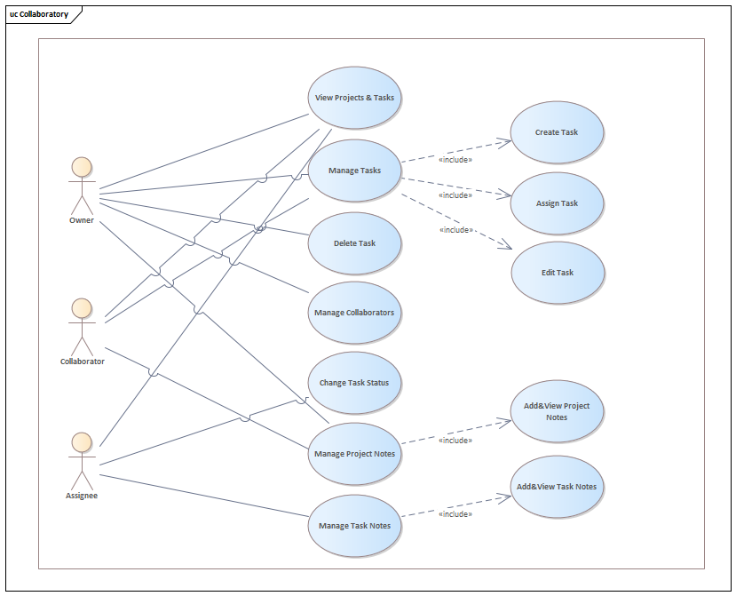

# Semester Two Project - Collaboratory

This project is intended to:

- Practice the complete process from **problem analysis to implementation**
- Apply basic **Python** programming concepts learned in the Programming Foundations module
- Demonstrate the use of **console interaction, data validation, and file processing**
- Produce clean, well-structured, and documented code
- Prepare students for **teamwork and documentation** in later modules
- Use this repository as a starting point by importing it into your own GitHub account.  
- Work only within your own copy — do not push to the original template.  
- Commit regularly to track your progress.

## 📝 Analysis

### Problem


### Scenario


## User Stories

### Owner

1. As an Owner, I want to create a new project so that I can organise tasks for my team in one place.
2. As an Owner, I want to manage collaborators so that I can control who has access to the project.
3. As an Owner, I want to create and assign tasks so that work is clearly distributed.
4. As an Owner, I want to edit and delete tasks so that the project stays organised and up to date.
5. As an Owner, I want to add and view project notes so that important information is documented and accessible.

### Assignee

1. As an Assignee, I want to view projects and tasks so that I understand my responsibilities clearly.
2. As an Assignee, I want to update the status of my tasks so that I can show my progress.
3. As an Assignee, I want to add and view task notes so that I can share updates and understand task context.

### Collaborator

1. As a Collaborator, I want to view projects and tasks so that I can support the Owner.
2. As a Collaborator, I want to create and edit tasks so that I can help organise the project work.
3. As a Collaborator, I want to assign tasks to users so that work is distributed effectively.
4. As a Collaborator, I want to add and view project notes so that important information is shared within the team.

## Use Case Diagram – Collaboratory



### Main Use Cases

- **View Projects & Tasks**: Users can view projects and tasks they have access to.
- **Manage Tasks**: Tasks can be created, edited, and assigned within a project.
- **Delete Task**: The Owner can remove tasks.
- **Manage Collaborators**: The Owner adds or removes collaborators.
- **Change Task Status**: Assignees update the progress of tasks.
- **Add & View Project Notes**: Owners and Collaborators document project information.
- **Add & View Task Notes**: Assignees add updates or comments to tasks.

### Actors

- **Owner**: Creates and manages projects, tasks, collaborators, and project notes.
- **Collaborator**: Supports the Owner by managing tasks and project notes.
- **Assignee**: Works on assigned tasks and updates their status.

## Roles & Permissions

A user's role is specific to each project — it depends on their relationship
to that project, not a global setting. Users can be Owners or Collaborators, as well as Assignees and Admins.
Maximum roles Collaboratory Admin and Owner or Collaborator of a Project, and Assigned to a Project's Task.

| Role | How you get it |
|---|---|
| **Owner** | You created the project |
| **Assignee** | You have been assigned to at least one task in the project |
| **\* Collaborator** | The Owner added you to the project |

> Users with `is_admin = true` have Owner-level access across all projects.
> This is a simple override for recovery/admin purposes, not a normal role.

| Action                         | Owner | Assignee | * Collaborator |
|--------------------------------|-------|----------|---------------|
| View project & tasks           | ✅    | ✅       | ✅            |
| Create task                    | ✅    | —        | ✅             |
| Assign task to user            | ✅    | —        | ✅             |
| Edit task details              | ✅    | —        | ✅             |
| Change task status             | —     | ✅       | —              |
| Delete task                    | ✅    | —        | —              |
| Add/remove collaborators       | ✅    | —        | —              |
*| Add Project Note              | ✅    | —        | ✅             |
*| View Project Notes            | ✅    | ✅       |✅             |
*| Add Task Note                 | —     | ✅       | —              |
*| View Task Note s              | ✅    | ✅       | ✅            |

---

## ✅ Project Requirements

Each application must contain the following elements. As “frontend” technology we have chosen
NiceGUI (https://nicegui.io/) which makes it possible to run Python apps in the browser:

1. Presentation Layer (Client-Side View): The browser acts as a thin client. It runs a generic
engine (based on Vue.js and Quasar) that renders UI components. It holds no business
logic and no persistent application state.
2. Application Logic (Server-Side Frontend): This is the core of the NiceGUI model. The UI
components (e.g., ui.button, ui.input etc.) are instantiated as Python objects on the
server. The state of these objects (their value, visibility, or enabled status) resides on the
server. Teams will use object-orientation in Python to organize business logic into
modular, reusable, and self-contained units.
3. Persistence Layer (Database): The physical data store (SQLite). You interact with a
database using an Object-Relational Mapper (ORM) to avoid writing SQL statements
directly.

---

### 1. Interactive App (GUI)
 
---
The application interacts with the user via a web browser. Users can perform the following steps:

1. User Login
2. Task Status
3. Task Assignment
4. Manage Workflows/Tasks
---


### 2. Data Validation

### Input validation and error handling

The application validates all user input (for example, usernames, task titles, descriptions, and status values) before processing or storing it. Invalid or incomplete data is rejected with a clear error message, ensuring that only consistent, well‑formed information is written to the database and used in workflows.

### Database information:
Core entities:
- Users — people who log in and get assigned tasks
- Projects — the top-level containers
- Tasks — the actual work items inside projects
- Assignments — links tasks to users (who's responsible)

#### Schema:
-------

#### Users

	id          (PK)
	username    (unique)
	name
	email       (unique)
	password    (hashed)
	is_admin	(bool)
	created_at

#### Projects

	id          (PK)
	name
	description
	owner_id    (FK → Users.id)
	created_at

#### Tasks

	id          (PK)
	title
	description
	status      (e.g. "todo", "in_progress", "completed")
	priority    (e.g. "low", "medium", "high")
	due_date
	project_id  (FK → Projects.id)
	created_by  (FK → Users.id)
	created_at

#### Assignments

	id          (PK)
	task_id     (FK → Tasks.id)
	user_id     (FK → Users.id)
	assigned_at

#### ProjectMember

	id          (PK)
	project_id  (FK → Projects.id)
	user_id     (FK → Users.id)

### Architecture

This application follows a 3-tier architecture:

#### 1. Presentation Tier (Frontend)
- **Technology:** NiceGUI
- Renders the user interface directly from Python — no separate HTML/CSS/JS codebase
- UI components (task boards, project views, dashboards) are defined and served by NiceGUI
- Runs in the user's browser via NiceGUI's built-in web server

#### 2. Application Tier (Backend)
- **Technology:** Python + NiceGUI (server-side logic)
- Handles all business logic: task creation, assignment, deadlines, and user roles
- Manages user sessions and authentication
- Acts as the bridge between the UI layer and the database

#### 3. Data Tier (Database)
- **Technology:** SQLAlchemy (ORM) + SQLite 
- SQLAlchemy models define the database schema in Python classes
- Stores all persistent data: users, projects, tasks, and assignments
- The backend interacts with the database exclusively through SQLAlchemy sessions

### ?Gui information:


	`code`


### ?Logic information: 


  
  Requirements:
1. 
2.
3. 
4. 

**Criteria**


### 3. File Processing

The application writes and reads data using a ** file with a ** structure :

- **Input and Output file:** `.json` — Contains the **

		`code goes here`
  
## ⚙️ Implementation

### Technology
- Python 3.x
- Environment: GitHub Codespaces
- External libraries: `nicegui` (web-based UI), `sqlalchemy` (ORM/database)

### 📂 Repository Structure
```
collaboratory/
├── database/            # physical data store connection and ORM models
├── logic/               # server-side business logic and state management
├── ui/                  # Python classes instantiating NiceGUI components
├── .gitignore           # specifies intentionally untracked files to ignore
├── LICENSE              # project usage license terms
├── README.md            # project documentation, user stories, and milestones
├── main.py              # application entry point linking the three tiers
└── requirements.txt     # list of Python dependencies for the project
```

### How to Run

1. Open the repository in **GitHub Codespaces**
2. Open the **Terminal**
3. Run:
	```bash
	python3 main.py
	```

### Libraries Used

- `json`: used for working with JSON data.
- `random`: for generating random numbers and making random selections.
- `string`: provides useful string constants and helpers, generating random strings, passwords, or validating characters.
- `nicegui`: for building web-based user interface.
- `sqlalchemy`: for working with the database.

The first three libraries (`json`, `random`, `string`) are part of the Python standard library and require no installation. `nicegui` and `sqlalchemy` are external dependencies and must be installed before running the application (e.g., via `pip install -r requirements.txt`).


## 👥 Team & Contributions

| Name                  | Final Contribution                                                                   |
| --------------------- | ------------------------------------------------------------------------------------ |
| Marta Greschuk        | document the work distribution                                                       |
| Polina Yemelianenkova | libraries, the 3-tier architecture plan, and the database schema within the read.me |
| Ayla Allen            | GitHub repository setup                                                              |
| Sümeyya Güçlü-Babür   | user stories and user cases                                                          |
## 🤝 Contributing

- Use this repository as a starting point by importing it into your own GitHub account or VScode on Desktop.  
- Work only within your own copy — do not push to the original template.  
- Commit regularly to track your progress.

## 📝 License

This project is provided for **educational use only** as part of the Programming Foundations module.  
[MIT License](LICENSE)
